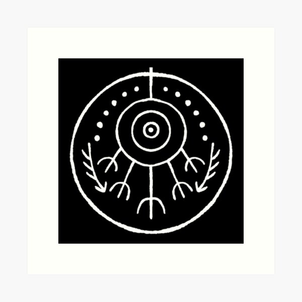

# [Игра на память](https://github.com/rolling-scopes-school/tasks/tree/master/tasks/memory-game) #
## Тема ##
Игра на память была сделана по теме аниме "Ателье колдовских колпаков". В мире аниме магия создается не врождённым даром, а с помощью навыков рисования заклинаний, представляющие из себя сигилы с глифами (символы и геометрические круги), нарисованные специальными чернилами, которые могут отвечать за упраление стихиями для помощи людям, есть также те которые несут чисто декоративную функцию.
#### Примеры:
Глиф огня:


Декоративный глиф, изображающий цветок:


Но знание об том как твориться магия является тайной и чтобы её сохранить колдуны прибегают к единственному заклинанию из запретной магии — стирание памяти:



Вовремя игры вы пытаетесь запомнить глифы, но вам мешает заклинание которое стирает память.

## Инструкции по локальному запуску ##

### Предварительные требования

Убедитесь, что у вас установлены:

* [Node.js](https://nodejs.org/) — версия 24.x или выше
* npm — входит в комплект Node.js

### Установка

1. Клонируйте репозиторий:

```bash
git clone https://github.com/KateHalitsa/memory-game.git
```

2. Перейдите в директорию проекта:

```bash
cd memory-game
```

3. Установите зависимости проекта:

```bash
npm install
```

### Запуск сервера разработки

Выполните следующую команду:

```bash
npm run dev
```

Vite запустит сервер разработки и выведет локальный URL в терминале, например:

```text
Local: http://localhost:5173/
```

Откройте этот URL в браузере.